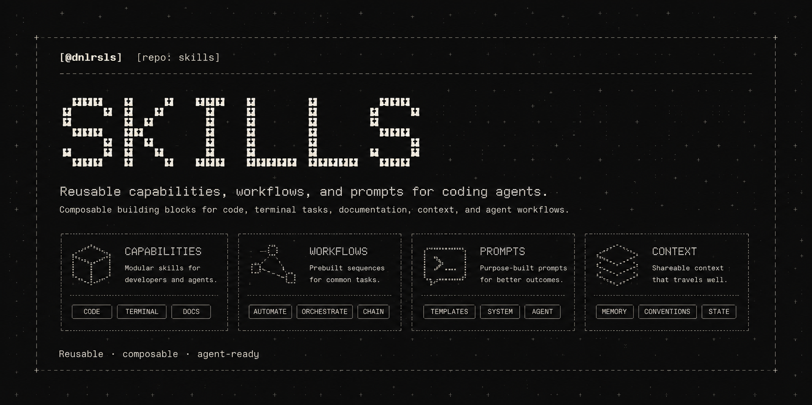

# Practical Skills for AI Agents

This repository contains reusable skills for tasks that AI agents can usually complete, but often handle slowly, inconsistently, or less effectively than they should. Each skill packages a proven workflow or guardrail so agents spend less time rediscovering the right approach and produce a better result sooner.

## Purpose

- Reduce the time agents lose on common, straightforward tasks.
- Correct recurring failure modes with proven workflows and guardrails.
- Reuse effective approaches across projects instead of solving the same problem again.
- Improve results without tying the workflow to one model, client, or technology stack.

## Contents

Each skill addresses a repeated task that agents are known to handle poorly or inefficiently. A skill is added only when the problem is recurring, the correction has proved useful, and the outcome can be verified.

Current skills:

- [`skill-creator`](skills/skill-creator/SKILL.md) — creates focused Agent Skills from proven, reusable corrections instead of speculative ideas.

## Documentation

- [Compatibility policy](docs/compatibility.md) — the portable canonical skill format and compatibility-claim policy.
- [Skill style guide](docs/skill-style-guide.md) — the normative guide for authoring and reviewing canonical skills.
